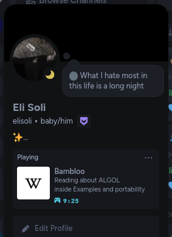

# Bambloo 🫐🐼
> Show your Discord friends what you're up to right now ✨

 
 

[**Bambloo**](https://github.com/pandasoli/bambloo) is a super easy web extension that lets you share
what you're up to in your browser with your friends on Discord.
It is straightforward, <ins>configurable</ins> and <samp>pretty</samp> 🫐

 

- Straightforward
- Simple
- User friendly
- Non hidden complexity
- Configurable

 
 

> [!WARNING]
> We are just starting, so there might not be many websites supports and bugs might occur.  
> If any bug occur please create an issue and we'll reply as soon as possible to fix it.

[Installing the Extension](#installing-the-extension-) |
[Installing the Host](#installing-the-host-) |
[How It Works](#how-it-works-)

 

[CS50 Demo Video](https://www.youtube.com/embed/aONnDZ7mH9w)

 
 

## Installing the Extension 🫐

The extension is already available on Firefox add-ons store, you can find here: [firefox/addon/bambloo](https://addons.mozilla.org/en-US/firefox/addon/bambloo)

While the extension is not available on the Chrome Store you can install it manually.

---

In the [Releases tab](https://github.com/pandasoli/bambloo/releases) you'll find the versions with their changelog and files.  
Under the `Assets` drop-down are the files, you can choose whether you prefer  
a zip file or a tarball. Download the one with the name "bambloo-extension".

If you prefer, you can build yourself by cloning this repo and running `bin run build`.

 

After downloading extract the file and follow the next steps accordingly to your browser:

	
Google Chrome

 

1. Inside your browser, type `chrome://extensions` in your searchbar or,
	click on the 3-dot button in the upper right corner, hover over the
	"Extensions" option and click on "Manage Extensions"

2. In the upper right corner enable `Developer mode`
3. Click on the "Load unpacked" button in the upper left corner
4. Search for and select the folder you extracted

	
Firefox

 

1. Inside your browser, type `about:debugging#/runtime/this-firefox` in the searchbar

2. Click on the "Load Temporary Add-on..." button under the "Temporary Extensions" drop-down
3. Search for and select the `manifest.json` file inside the folder you extracted

 
 

## Installing the Host 🐼

The extension alone is not enough, it needs a way to talk to Discord.  
The way we found is having a program (a host) running on your system next to Discord.

We have a variety of hosts, you can choose the one you feel most comfortable with.  
Hosts differ by connection method, but don't worry about this unless you're a developer,  
and programming language, you might prefer a Python host, or maybe a binary one?

 

**Connection methods:**

- [Native Messaging](https://developer.chrome.com/docs/extensions/develop/concepts/native-messaging)

	Ideal if you work with web development or networks and need all possible ports available.

- WebSocket

  > ✨ Recommended for **Bambloo** debugging

 	The difference from a Native Messaging host is that you'll have to run this host  
  on your terminal whenever you want to use **Bambloo**.

	
Hosts system support table

 

| Language | Connection Method | Supported systems
| --       | --                | --
| Python   | WebSocket         | `Linux` `Windows`
| Python   | NativeMessaging   | `Linux` `Windows`

 

That being said let's install a host!  
In the [Releases tab](https://github.com/pandasoli/bambloo/releases) you'll also find files named "\<method\>-hosts". Download and extract one,  
and if you chose a WebSocket host you can just run the file called `ws-bambloo`, otherwise:

 

### How to install Native Messaging hosts

In the extracted folder there's a file called `install.sh` for Linux, and `install.cmd` for Windows.  
If you prefer a TUI installer, there's the `init.cmd` file inside `win32-tui` for Windows.

To install the host run this file with the arguments:
- `--browser <browser name>`
- `--id <extension ID>`
- (optional) `--dist <host installation folder>`
- (optional) `--lang <host programming language>`

The "Extension ID" is found at `chrome://extensions` on Chrome and  
at `about:debugging#/runtime/this-firefox` on Firefox.

If your browser is not supported by this file, join our Discord server and  
our professionals will help you and add official support to your browser.
 
 

## How it works ✨
> If you are a developer please refer to the [Developer Docs](DEVELOPER.md) for a more detailed explanation.

The extension's service worker manages all the data and events of the extension,  
when you install a Presence through the Store tab you are getting a manifest file  
from the repositories you have configured (default: https://github.com/pandasoli/bambloo-repo),  
and this manifest file contains the path inside the repository where lies a script,  
which that run on the tab it was made to run and collects information about the page,  
which later is sent to the service worker, then to the host and then to Discord.
